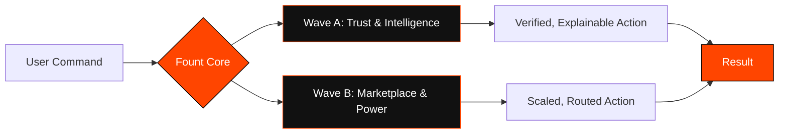
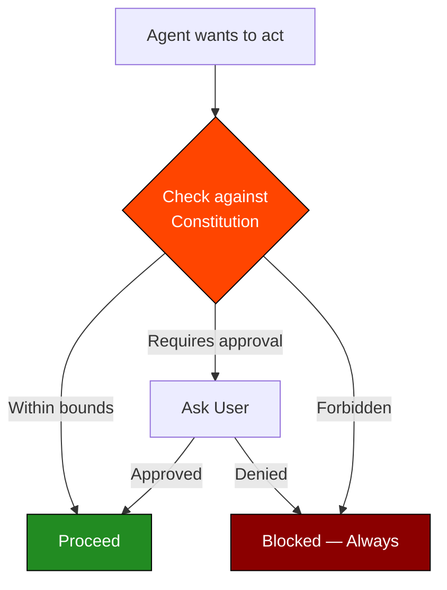
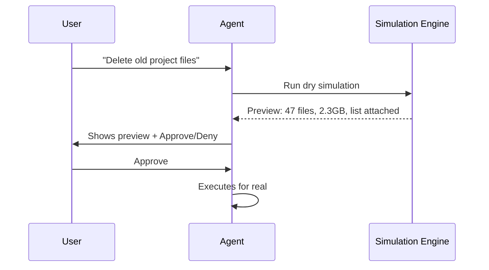
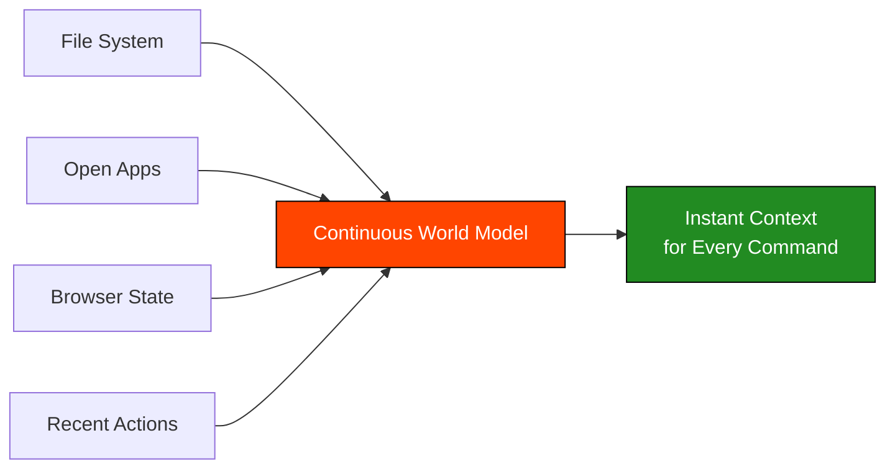
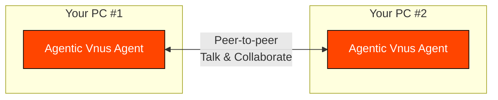
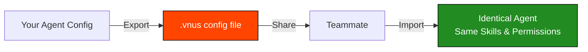
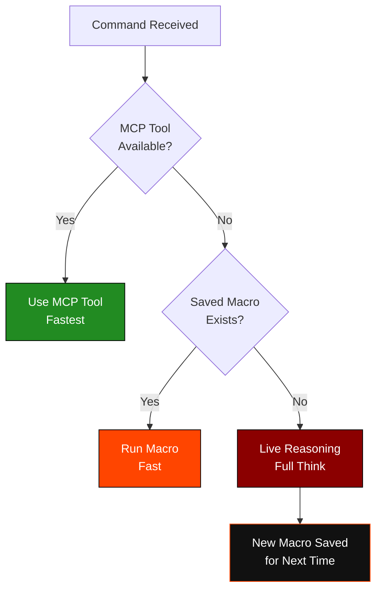
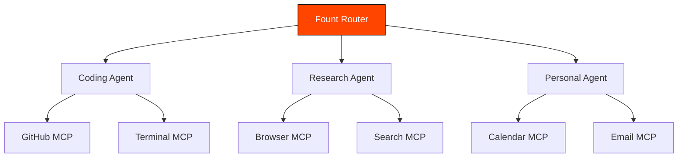
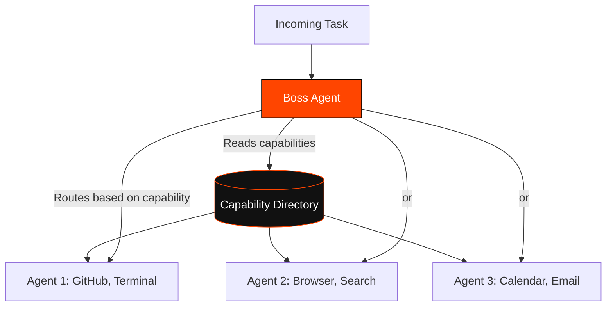
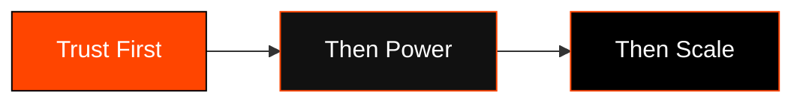

# Agentic Vnus — FOUNT

### *Source of All Intelligence*

**The next evolution of Agentic Vnus.**
Not a patch. Not a feature drop. A new foundation.

**⏳ Arriving in the next few days — coming directly to existing users.**

---

##  What Is Fount?

Fount is built on one idea: **an agent should be trustworthy before it's powerful, and powerful without needing permission from a marketplace.**

Every feature below fits into one of two waves. Wave A makes the agent something you can trust completely — it explains itself, previews itself, and understands your world continuously. Wave B makes the agent something that scales — across teams, across tools, across other agents — without losing that trust.

---

## 

*Before an agent gets more power, it needs to earn more trust. Wave A is that foundation.*

###  Agent Constitution

A fixed, persistent set of rules the agent cannot act outside of — not a prompt, not a setting, a **constitution**. Every action the agent takes is checked against it before execution, not after.

Instead of trusting the model to "remember" to be safe, the Constitution sits underneath the model as a non-negotiable boundary layer. It defines what the agent is always allowed to do, always forbidden from doing, and what always requires your explicit approval — regardless of how a command is phrased or what the AI reasons its way into.

---

###  Simulation / Preview Mode

Before running a risky or irreversible action, the agent shows you **what would happen** — not just what it plans to do in words, but a real preview of the outcome. See the diff before the commit. See the file list before the delete. See the changed state before it's changed.

This turns every meaningful action into a dry-run first, real-run second workflow — without slowing down the safe, everyday commands that don't need it.

---

###  Continuous World Model

The agent doesn't re-scan your system from scratch every time you give it a command. It keeps a **live, continuously updated model** of your files, apps, browser state, and recent activity — so it already knows the context the moment you type.

This is the difference between an agent that has to "look around" every time, and one that already knows where things are, what changed, and what you were doing five minutes ago.

---

###  Local Personalization

The agent adapts to **you specifically** — your phrasing, your file structures, your habits — and it does so entirely on-device. No profile sent anywhere, no personalization-as-a-service. Your patterns stay exactly where they were learned: your machine.

Built on top of the Continuous World Model, this is one of the first systems of its kind available anywhere — local, private, per-user adaptation with zero cloud involvement. It's already working, and it will keep getting sharper with every update.

---

###  Inter-Agent Protocol

Your agents stop being isolated. With the Inter-Agent Protocol, the Agentic Vnus running on **one of your PCs can talk directly to the Agentic Vnus running on another one of your PCs** — coordinating tasks, sharing context, and working together across machines, without any cloud server sitting in the middle.

Practically, this means your agent on your desktop can hand off a task to your agent on your laptop, check on its progress, or simply have a conversation with it to sync up — all peer-to-peer, all private.

This is one of the first systems of its kind to exist — there's nothing quite like it in the market yet. It's launching in its early form now, and it will keep getting more capable with every update that follows.

---

## 

*Once an agent can be trusted, it should be able to scale — across tools, teams, and other agents.*

###  Config-Level Agent + Team Sharing

Share an entire agent setup — skills, permissions, memory scope, tool access — as a single portable config file. A teammate imports it and gets the exact same agent behavior instantly, without rebuilding it from scratch.

---

###  Universal Tool Router — MCP → Macro → Live Reasoning

The agent doesn't reason from scratch for every task. When a command comes in, it checks — in order — whether an MCP tool already handles it, whether a saved macro/skill already solves it, and only falls back to full live reasoning if neither exists. Fastest path first, always.

This is what makes the agent get **faster the more it's used** — every live-reasoning solve becomes a macro, every macro becomes near-instant next time.

---

###  Per-Agent Separate MCP Assignment

Not every agent instance needs every tool. Fount lets you assign a **different set of MCP servers to each agent** — a coding agent gets GitHub and terminal tools, a research agent gets browser and search tools, a personal agent gets calendar and email — each scoped to exactly what it needs, nothing more.

---

###  Boss Agent Data Symmetry — Capability Directory

When you're running multiple agents, one **Boss Agent** maintains a live directory of what every other agent can do — its tools, its skills, its current state. No agent is a black box to the system; the Boss always knows who can do what, so it can route tasks to the right agent instead of guessing.

---

##  Roadmap Overview

| Wave | Feature | Focus | Status |
|---|---|---|---|
| A | Agent Constitution | Trust boundary layer | Coming Soon |
| A | Simulation / Preview Mode | Pre-action safety | Coming Soon |
| A | Continuous World Model | Live context awareness | Coming Soon |
| A | Local Personalization | On-device adaptation | Coming Soon |
| A | Inter-Agent Protocol | Cross-device agent collaboration | Coming Soon |
| B | Config-Level Sharing | Team-wide agent configs | Coming Soon |
| B | Universal Tool Router | MCP → Macro → Reasoning | Coming Soon |
| B | Per-Agent MCP Assignment | Scoped tool access | Coming Soon |
| B | Boss Agent Capability Directory | Multi-agent orchestration | Coming Soon |

**All 9 features are arriving together, in the next few days.**

---

##  The Core Idea

Every feature above exists to answer one question in order: **can you trust it, can it act, can it scale** — never the reverse.

---

**Built by Prince Tanwar — Founder, Agentic Vnus**

*Your assistant. Your machine. Your rules.*

